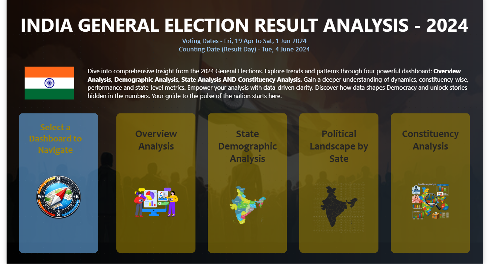
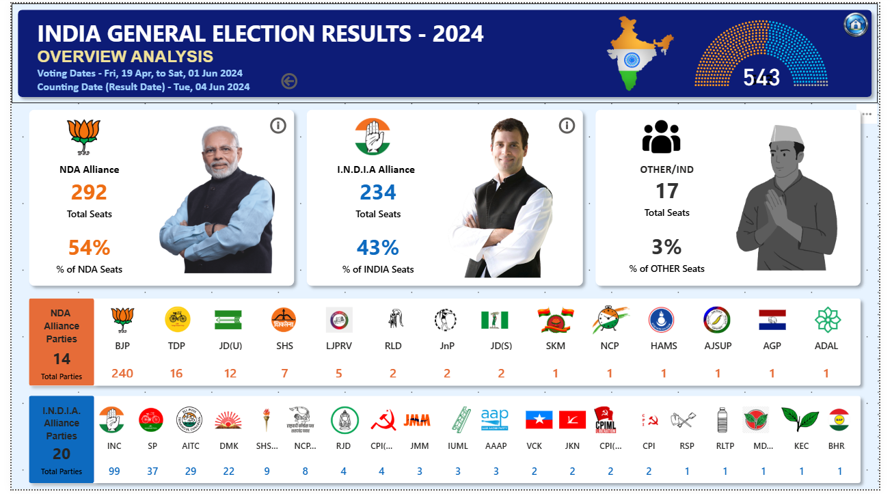
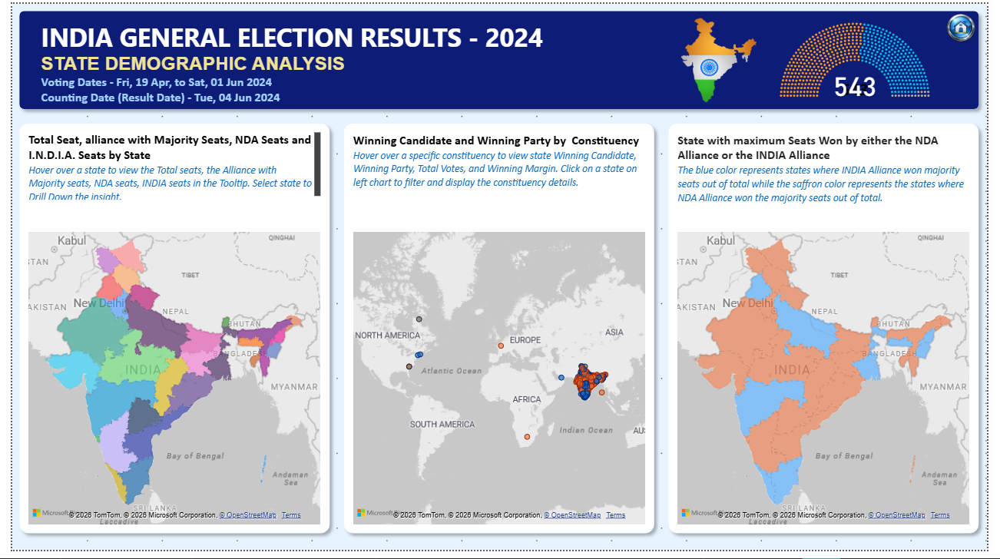
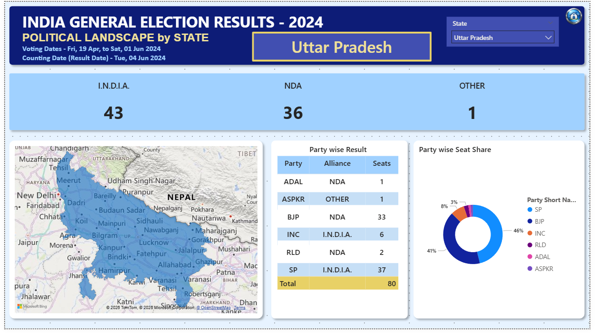
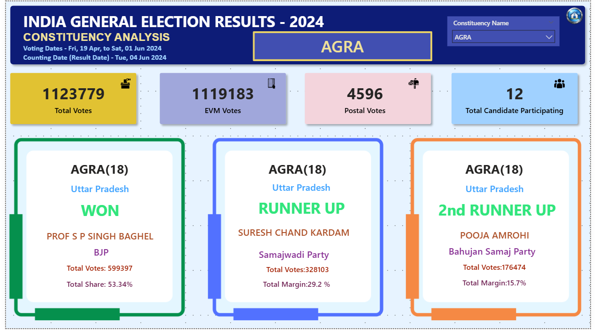

# 🗳️ Election 2024 Dashboard Analysis (Power BI)

## 📌 Project Overview  
This project analyzes Election 2024 data using an interactive Power BI dashboard to uncover voting trends, party performance, and constituency-level insights.

---

## 🎯 Business Objective  
- Analyze voting patterns across regions  
- Compare party performance  
- Identify high-impact constituencies  
- Provide insights for strategic decision-making  

---

## 🛠 Tools Used  
- Power BI  
- Data Cleaning & Modeling  
- DAX  

---

## 📊 Dashboard Highlights  

### 📍 Overview Dashboard  

---

### 📈 Voting Trends  

---

### 🗺️ Constituency Analysis  

---

### ⚖️ Party Comparison  

---

### 🏛️ Constituency Level Analysis  

---

## 📈 Key Insights  

- Certain regions show strong dominance of specific parties  
- Voting patterns vary significantly across constituencies  
- Competitive regions indicate potential swing areas  
- Data highlights key areas for campaign focus  

---

## 💡 Conclusion  

This dashboard provides a clear, interactive view of election data, helping stakeholders understand trends and make informed decisions.

---

## 📂 Project Files  
- `Election 2024.pbix` → Power BI dashboard file  
